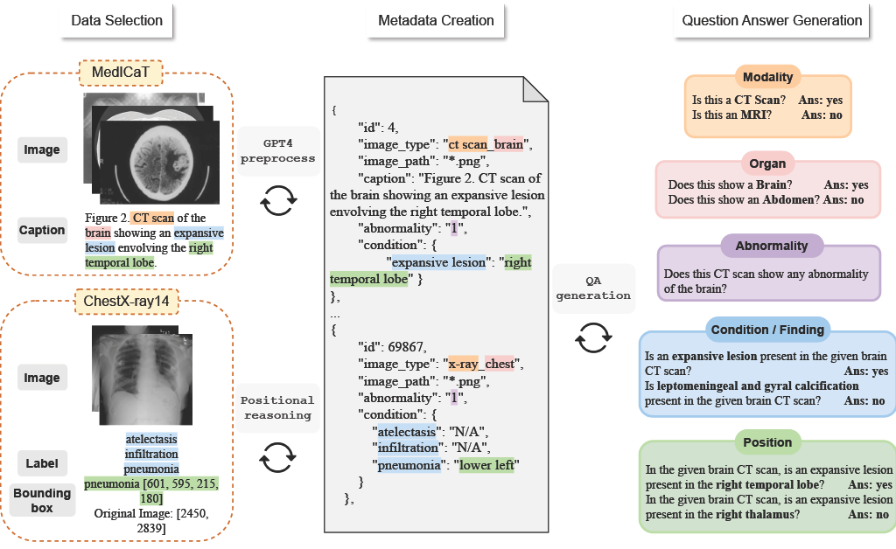

# ProbMed

[**🌐 Homepage**](https://jackie-2000.github.io/probmed.github.io/) | [**🤗 Dataset**](https://huggingface.co/datasets/rippleripple/ProbMed) | [**🤗 Paper**](https://github.com/eric-ai-lab/ProbMed/) | [**📖 arXiv**](https://github.com/eric-ai-lab/ProbMed/) | [**GitHub**](https://github.com/eric-ai-lab/ProbMed/)


This repo contains the evaluation code for the paper "[Worse than Random? An Embarrassingly Simple Probing Evaluation of Large Multimodal Models in Medical VQA]([https://arxiv.org/pdf/2311.16502.pdf](https://github.com/eric-ai-lab/ProbMed/))"


## Introduction
We introduce the <b>Probing Evaluation for Medical Diagnosis (ProbMed)</b> dataset to rigorously assess LMM performance in medical imaging through <b>probing evaluation</b> and <b>procedural diagnosis</b>. Particularly, probing evaluation features pairing original questions with negation questions with hallucinated attributes, while procedural diagnosis requires reasoning across various diagnostic dimensions for each image, including modality recognition, organ identification, clinical findings, abnormalities, and positional grounding. ProbMed draws from two comprehensive biomedical datasets MedICaT and ChestX-ray14 to compile a diverse set of <b>6,303 images</b>. These images span three modalities (X-ray, MRI, and CT scan) and four organs (abdomen, brain, chest, and spine). After preprocessing, we generated a diverse set of high-quality questions for each image, covering various diagnostic dimensions. This process resulted in a total of <b>57,132 question-answer pairs</b>, averaging 9 pairs per image.



## Dataset Creation

ProbMed was created to rigorously evaluate LMMs’ readiness for real-life diagnostic tasks, particularly under adversarial conditions. Please refer to our huggingface [**🤗 Dataset**](https://huggingface.co/datasets/rippleripple/ProbMed) for more details.

## Evaluation
Please refer to our [eval](eval)
 folder for more details.

## 🏆 Leaderboard
| Model           | Modality  | Organ     | Abnormality | Condition/Finding | Position | 
|-----------------|:---------:|:---------:|:-----------:|:-----------------:|:--------:|
| Random Choice   | 25.00	    | 25.00	    | 50.00	      | **35.67**	        | **36.48**|
|-----------------|:---------:|:---------:|:-----------:|:-----------------:|:--------:|
| GPT4V           | 92.50	    | 71.71	    | 53.30	      | 35.19	            | 22.32    |
| Gemini 1.5 Pro  | **96.47** | 75.69	    | 62.59	      | 27.92	            | 17.17    |
| CheXagent       | 37.26	    | 33.96	    | **73.32**	  | 28.53	            | 7.24     |
| LLaVA-Med       | 5.49	     | 32.98	    | 38.76	      | 20.39	            | 5.37     |
| MiniGPT-v2      | 3.25	     | 76.29	    | 50.09	      | 15.23	            | 8.05     |
| LLaVA-v1.6 (7B) | 6.77	     | **80.70**	| 46.18	      | 3.57	             | 1.07     |
| LLaVA-v1 (7B)   | 25.28	    | 40.53	    | 50.00	      | 0.34		            | 0.10     |

## Contact
- Qianqi Yan: qyan79@ucsc.edu
- Xin Eric Wang: xwang366@ucsc.edu

## Citation

**BibTeX:**
```bibtex
@inproceedings{yue2023mmmu,
  title={MMMU: A Massive Multi-discipline Multimodal Understanding and Reasoning Benchmark for Expert AGI},
  author={Xiang Yue and Yuansheng Ni and Kai Zhang and Tianyu Zheng and Ruoqi Liu and Ge Zhang and Samuel Stevens and Dongfu Jiang and Weiming Ren and Yuxuan Sun and Cong Wei and Botao Yu and Ruibin Yuan and Renliang Sun and Ming Yin and Boyuan Zheng and Zhenzhu Yang and Yibo Liu and Wenhao Huang and Huan Sun and Yu Su and Wenhu Chen},
  booktitle={Proceedings of CVPR},
  year={2024},
}
```
